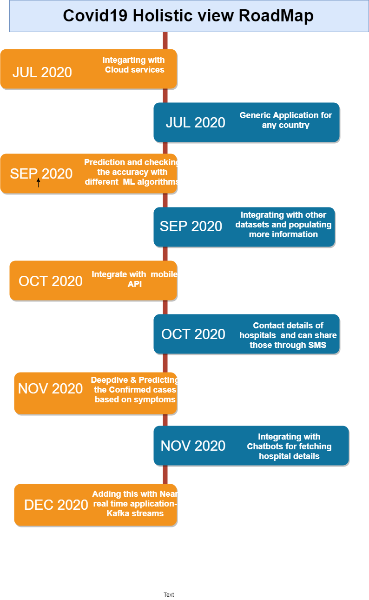

# Covid-19 Holistic View

**Application to give a centralised view of current Covid-19 situation.**

## Contents

1. [Short description](#short-description)
1. [Demo video](#demo-video)
1. [Covid-19 Holistic View Architecture](#the-architecture)
1. [Long description](#long-description)
1. [Application RoadMap](#application-roadmap)
1. [Getting started](#getting-started)
1. [Running the tests](#running-the-tests)
1. [Built with](#built-with)
1. [Authors](#authors)
1. [Reference](#reference)


## Short description

Coronavirus disease (COVID-19) is an infectious disease caused by a newly discovered coronavirus.
Most people infected with the COVID-19 virus will experience mild to moderate respiratory illness and recover without requiring special treatment.  Older people, and those with underlying medical problems like cardiovascular disease, diabetes, chronic respiratory disease, and cancer are more likely to develop serious illness.
The best way to prevent and slow down transmission is be well informed about the COVID-19 virus, the disease it causes and how it spreads. Protect yourself and others from infection by washing your hands or using an alcohol-based rub frequently and not touching your face.
The COVID-19 virus spreads primarily through droplets of saliva or discharge from the nose when an infected person coughs or sneezes, so it’s important that you also practice respiratory etiquette (for example, by coughing into a flexed elbow).
Currently, there are no specific vaccines or treatments for COVID-19. However, there are many ongoing clinical trials evaluating potential treatments. WHO will continue to provide updated information as soon as clinical findings become available?

### What's the problem?

The Novel coronavirus (Covid-19) Active cases are increases day by day and has caused acute shortage of healthcare infrastructure. It is important to plan for the medical infrastructure and supplement wherever necessary as per the current situation and active cases

### How can technology help?

Application will help to get the COVID-19 details state wise It is containing information i.e. COVID-19 cases, Recovered cases, Number of Death, Beds in Rural and urban, Availability of Rural and urban beds . These details will be taken from Govt. Website on daily basis, So Person can get updated data.
It is not only help individual, even it will help administration also to get future of COVID-19 cases in country/State. So Appropriate action can be taken.

### The idea

Application will help to get the COVID-19 details state wise It is containing information i.e. COVID-19 cases, Recovered cases, Number of Death, Beds in Rural and urban, Availability of Rural and urban beds . These details will be taken from Govt. Website on daily basis, So Person can get updated data.
It is not only help individual, even it will help administration also to get future of COVID-19 cases in country/State. So Appropriate action can be taken.

### Application Benefit

- Publish SMS alert via SMS Service to any user with latest updates via SMS
- Prevent from fake information
- Provide COVID-19 status of country and state
- Help people/Govt. to take further steps accordingly
- To provide total Beds and available Beds status in urban and rural area
- Medical situations are in India and what are estimates and trends.
- Geographical graphs with holistic view of covid cases along with bed details across the hospitals

## Demo video

[](https://youtu.be/dxZ28ts2Wfw)

## Covid-19 Holistic View Architecture


## Long description

### Functionality

### Alert SMS

Python API is used to send alert SMS to given contact number. It is optional feature. This functionality is not storing any data.
Below details will be send via SMS:
•	Total cases: Number
•	Recovered Cases: Number
•	Available Beds: Number

### Authenticated Data

Code will directly take information from Govt. Website. It will help not to spread fake information.

### Graphical Representation

This idea contains graphical view so Inclusive awareness can be spread to each part of society

### Predication for Administration/ Individuals

Based on Current and Past data, application is Predicting how country/State will be impacting from COVID-19

## Application RoadMap



## Getting started

**Technologies Used**

- Python
- iPy
- csv
- HTML
- Github
- Docker

### Prerequisites

- Anaconda/Python 3
- Account on fast2sms.com

### Installing

- Python3
- Flask

## Running the tests

Validating the Source output through graphs and plots

### Break down into end to end tests

### Alert Message

```
State: All, Confirmed cases:103383,
Recovered Cases:109429, Available Beds:6381
```

### Graph Bar chart

Plotted

### 3D View

Plotted

### Prediction Graph

Plotted

### Coding Style Tests

Passed

## Built with

* [Docker](https://www.docker.com/)

## Authors

- Praveena Chakkarapani
- Sneha Koul
- Chetana Chunduru
- Rakhi Swami
- Sowmya Kollipara

## Reference

- https://www.who.int/health-topics/coronavirus#tab=tab_1
- https://www.mohfw.gov.in/